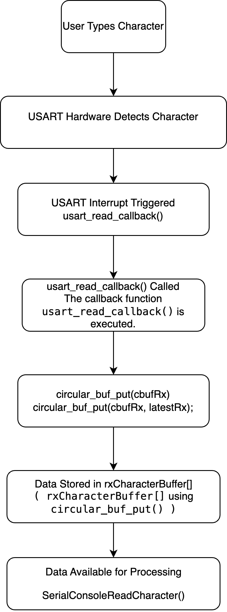
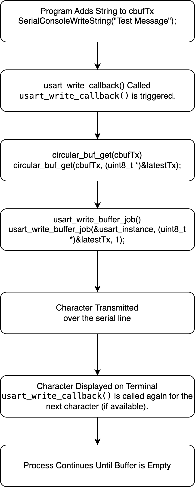
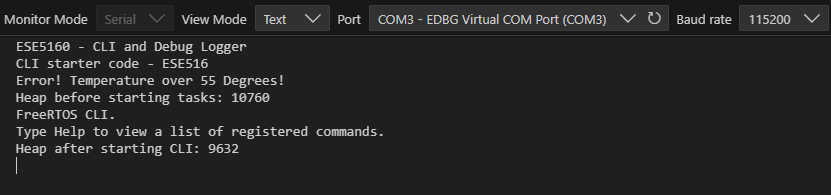
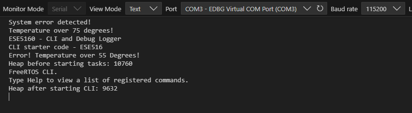
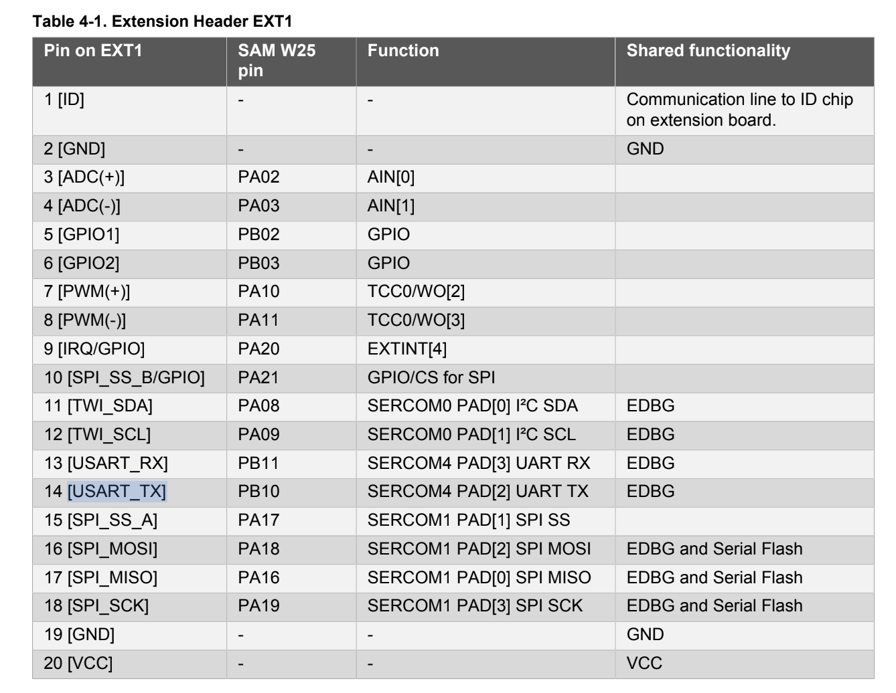
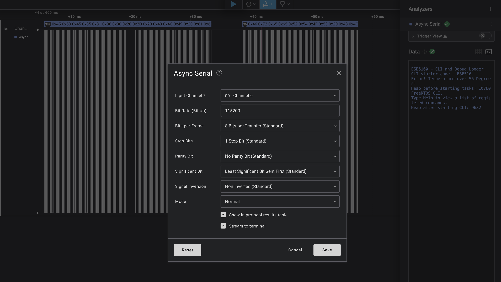
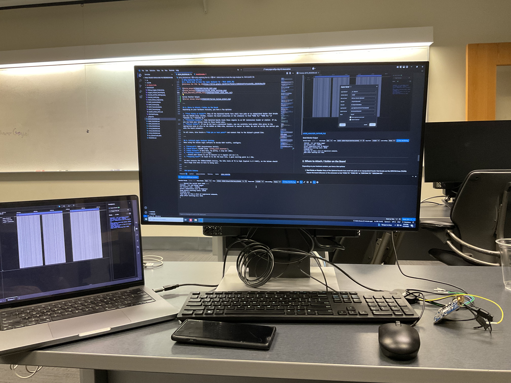
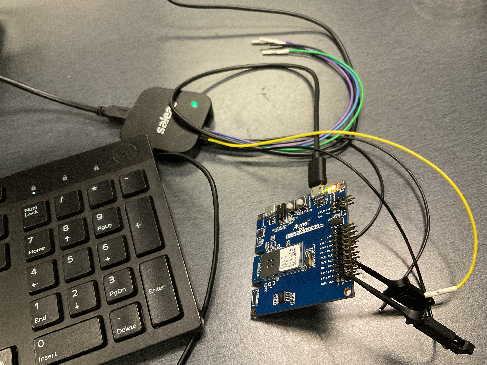
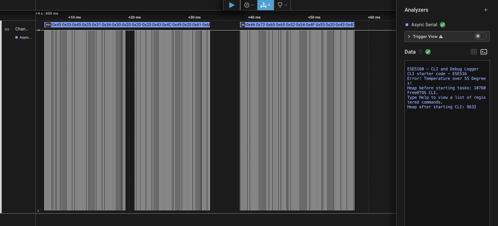

# a07g-exploring-the-CLI

* Team Number: 13
* Team Name: DreamCatcher
* Team Members: Abhik, Toma
* GitHub Repository URL: https://github.com/ese5160/final-project-a07g-a14g-t13-dreamcatcher.git
* Description of test hardware: (development boards, sensors, actuators, laptop + OS, etc): A07 (CLI)

## 0. Install Percepio


## 1. Software Architecture


## 2. Understanding the Starter Code

### 1. What does `InitializeSerialConsole()` do?
The function `InitializeSerialConsole()` initializes the UART channel and sets up asynchronous communication. Specifically, it:
- Initializes the RX and TX circular buffers using `circular_buf_init()` (defined in `circular_buffer.c`).
- Configures the USART for UART operation at **115200 baud**, **8N1** format using `configure_usart()` function.
- Registers the callbacks for RX and TX using `configure_usart_callbacks()` function.
- Starts a continuous UART reading job with `usart_read_buffer_job()`.

---

### 2. In said function, what is `cbufRx` and `cbufTx`? What type of data structure is it?
`cbufRx` and `cbufTx` are **handles** for circular buffers used to store received and transmitted UART data.  
- Type: `cbuf_handle_t` (defined as `circular_buf_t *` in `circular_buffer.h`).  
- Circular buffer is implemented in `circular_buffer.c` as a `struct` containing:
  - `buffer`: pointer to the buffer.
  - `head`, `tail`: indexes to track the position of data.
  - `max`: buffer size.
  - `full`: flag to indicate if the buffer is full.

---

### 3. How are `cbufRx` and `cbufTx` initialized? Where is the library that defines them (please list the *.C file they come from)?
They are initialized in `InitializeSerialConsole()` in **`SerialConsole.c`**:
```c
cbufRx = circular_buf_init((uint8_t *)rxCharacterBuffer, RX_BUFFER_SIZE);
cbufTx = circular_buf_init((uint8_t *)txCharacterBuffer, TX_BUFFER_SIZE);
```
- `circular_buf_init()` allocates memory and sets up the circular buffer.

**Library:**  
- Defined in **`circular_buffer.c`**  
- Declared in **`circular_buffer.h`**  

---

### 4. Where are the character arrays where the RX and TX characters are being stored at the end? Please mention their name and size.
- **RX Buffer:** `rxCharacterBuffer` (Size: 512 bytes)  
- **TX Buffer:** `txCharacterBuffer` (Size: 512 bytes)  

Defined globally in `SerialConsole.c`:
```c
char rxCharacterBuffer[RX_BUFFER_SIZE];
char txCharacterBuffer[TX_BUFFER_SIZE];
```

---

### 5. Where are the interrupts for UART character received and UART character sent defined?
The interrupts are registered in `configure_usart_callbacks()` in **`SerialConsole.c`**:
```c
usart_register_callback(&usart_instance, usart_write_callback, USART_CALLBACK_BUFFER_TRANSMITTED);
usart_register_callback(&usart_instance, usart_read_callback, USART_CALLBACK_BUFFER_RECEIVED);
```
The USART is configured with:
```c
usart_enable_callback(&usart_instance, USART_CALLBACK_BUFFER_TRANSMITTED);
usart_enable_callback(&usart_instance, USART_CALLBACK_BUFFER_RECEIVED);
```

---

### 6. What are the callback functions that are called when:
#### a) A character is received? (RX)
- **Callback Function:** `usart_read_callback()`  
- **Actions:**
  - Adds the character to `cbufRx` using `circular_buf_put()`.
  - Initiates another read job using `usart_read_buffer_job()`.

#### b) A character has been sent? (TX)
- **Callback Function:** `usart_write_callback()`  
- **Actions:**
  - Gets the next character from `cbufTx` using `circular_buf_get()`.
  - Writes it using `usart_write_buffer_job()`.

---

### 7. Explain what is being done on each of these two callbacks and how they relate to the `cbufRx` and `cbufTx` buffers.
- **RX Callback:**  
  - When a character is received, `usart_read_callback()` is triggered.  
  - The received character is added to `cbufRx` using `circular_buf_put()` to store it in the RX buffer.  
  - Starts another read job using `usart_read_buffer_job()` to receive more characters continuously.  

- **TX Callback:**  
  - When a character is transmitted, `usart_write_callback()` is triggered.  
  - The next character is fetched from `cbufTx` using `circular_buf_get()`.  
  - The character is sent using `usart_write_buffer_job()`.  
  - The process continues until the TX buffer is empty.  

---

### 8. Draw a diagram that explains the program flow for UART receive – starting with the user typing a character and ending with how that character ends up in the circular buffer `cbufRx`. Please make reference to specific functions in the starter code.
```plaintext
[User Types Character] ---> [USART Hardware] ---> [USART Interrupt Triggered] ---> 
[usart_read_callback()] ---> [circular_buf_put(cbufRx)] ---> [Data stored in rxCharacterBuffer]
```

1. User types a character in the terminal.  
2. USART hardware detects the character and generates an interrupt.  
3. `usart_read_callback()` is triggered.  
4. The character is added to `cbufRx` using `circular_buf_put()`.  
5. The character is stored in `rxCharacterBuffer[]`.  



---

### 9. Draw a diagram that explains the program flow for the UART transmission – starting from a string added by the program to the circular buffer `cbufTx` and ending on characters being shown on the screen of a PC (On Teraterm, for example). Please make reference to specific functions in the starter code.
```plaintext
[Program Adds String to cbufTx] ---> [usart_write_callback()] ---> 
[circular_buf_get(cbufTx)] ---> [usart_write_buffer_job()] ---> 
[Character Displayed on Terminal]
```

1. Program adds string to `cbufTx` using `circular_buf_put()`.  
2. If USART is ready, `usart_write_callback()` is triggered.  
3. The next character is fetched from `cbufTx` using `circular_buf_get()`.  
4. The character is transmitted using `usart_write_buffer_job()`.  
5. Characters are shown on the terminal.  


---

### 10. What is done on the function `StartTasks()` in main.c? How many threads are started?
- Initializes tasks required for the system.
- Specifically, it creates the **CLI task** using:
```c
if (xTaskCreate(vCommandConsoleTask, "CLI_TASK", CLI_TASK_SIZE, NULL, CLI_PRIORITY, &cliTaskHandle) != pdPASS)
```
- **Two threads** are created:
  - **CLI Task** – Handles the command-line interface.
  - **Daemon Task** – Created via `vApplicationDaemonTaskStartupHook()`.

Flow:
```plaintext
vApplicationDaemonTaskStartupHook()
    -> StartTasks()
        -> vCommandConsoleTask()
```

## 3. Debug Logger Module

```c
void LogMessage(enum eDebugLogLevels level, const char *format, ...)
{
    // Only log if the level is equal to or higher than the current debug level
    if (level < currentDebugLevel) {
        return;
    }

    char buffer[256];
    va_list args;
    va_start(args, format);

    // Format the message using vsnprintf()
    vsnprintf(buffer, sizeof(buffer), format, args);

    // Write the message to the serial console
    SerialConsoleWriteString(buffer);

    va_end(args);
}
```


```c
void usart_read_callback(struct usart_module *const usart_module)
{
    // Add the received character to the circular buffer
    circular_buf_put(cbufRx, latestRx);

    // Kick off another read operation to continuously receive data
    usart_read_buffer_job(&usart_instance, (uint8_t *)&latestRx, 1);
}
```


```c
#include "SerialConsole.h"

void testLogger(void) {
    int sensorTemperature = 75;

    setLogLevel(LOG_ERROR_LVL);

    LogMessage(LOG_INFO_LVL, "Starting test...\r\n"); // Won't print
    LogMessage(LOG_ERROR_LVL, "System error detected!\r\n"); // Will print
    LogMessage(LOG_FATAL_LVL, "Temperature over %d degrees!\r\n", sensorTemperature); // Will print
}

int main(void) {
    system_init();
    InitializeSerialConsole();

    testLogger();

    while (1) {
        // Main loop
    }

    return 0;
}
```



Serial Monitor Output



Serial Monitor Output from the to check custom case

## 4. Wiretap the convo!


### 1. Which Nets to Hook the Logic Analyzer To?
Because the code in **SerialConsole.c** configures a standard UART (SERCOM) for communication with the EDBG, we need the following signals:

1. **SAMD21/SAMW25 TX** – This is the line going from the microcontroller to the EDBG (the EDBG’s RX pin) PB11.  
2. **SAMD21/SAMW25 RX** – This is the line going from the EDBG to the microcontroller (the EDBG’s TX pin) PB10.  
3. **Ground Reference** – Common GND is required so the logic analyzer readings have the same reference.

From the code snippet:

```c
config_usart.baudrate      = 115200;
config_usart.mux_setting   = EDBG_CDC_SERCOM_MUX_SETTING;
config_usart.pinmux_pad0   = EDBG_CDC_SERCOM_PINMUX_PAD0;
config_usart.pinmux_pad1   = EDBG_CDC_SERCOM_PINMUX_PAD1;
config_usart.pinmux_pad2   = EDBG_CDC_SERCOM_PINMUX_PAD2;
config_usart.pinmux_pad3   = EDBG_CDC_SERCOM_PINMUX_PAD3;
```

Those `pinmux_padX` macros map SERCOM pins to actual device pins that connect to the EDBG’s TX/RX lines. Physically, on the SAMW25 Xplained board, these are the nets that go directly to the on-board EDBG chip.


[Reference for PIN: Pg 10](https://drive.google.com/drive/folders/1OKUS5nEYTnFtutdxYD2_j58JUhIHwzTN)

---

### 2. Where to Attach / Solder on the Board: : PB10 (UART_TX)
Depending on your hardware revision, you have a few options:

1. **Test Points or Header**: Many of the Xplained boards have small test pads or an unpopulated header that breaks out the SERCOM lines (TX/RX). Inspect the board silkscreen or the schematic to find “EDBG TX,” “EDBG RX,” or “SERCOM4 TX,” “SERCOM4 RX.”  
2. **Extension Headers**: Some Xplained boards route these signals to an EXT (extension) header or similar. If so, you can hook your Saleae leads on those header pins.  
3. **Direct Solder**: If you do not have a convenient header, you can carefully tack-solder thin wires to the appropriate pads or pins on the SAMW25 or EDBG side, whichever is easier to reach. Be sure to verify the correct pin with the board schematic.

In all cases, also locate a **GND pin or test point** and connect that to the Saleae’s ground line.

---

### 3. Critical Logic Analyzer Settings
When using the Saleae Logic software to decode UART traffic, configure:



1. **Protocol**: UART (Asynchronous Serial).  
2. **Baud Rate**: 115200 (from `config_usart.baudrate`).  
3. **Data Format**: 8 data bits, No parity, 1 stop bit (8N1).  







LOGIG_ANALYSER_CAPTURE_FILE:
[LOGIG_ANALYSER_CAPTURE_FILE](IMAGESA07/USART_LOGIC_ANYL.sal)

---

## 5. Complete the CLI


## 6. Add CLI commands

## 7. Using Percepio